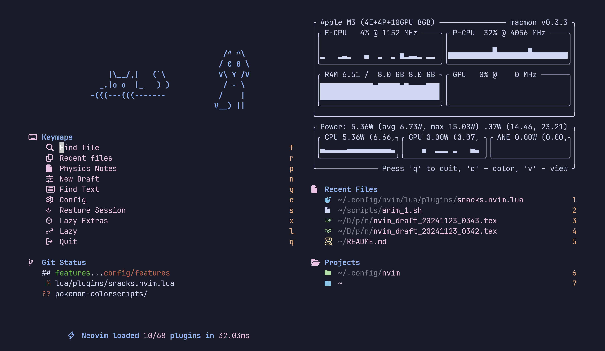
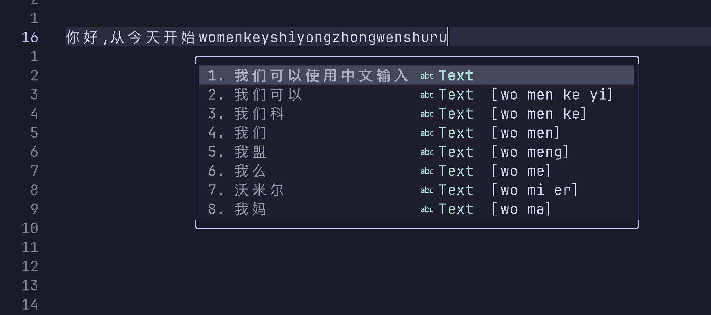
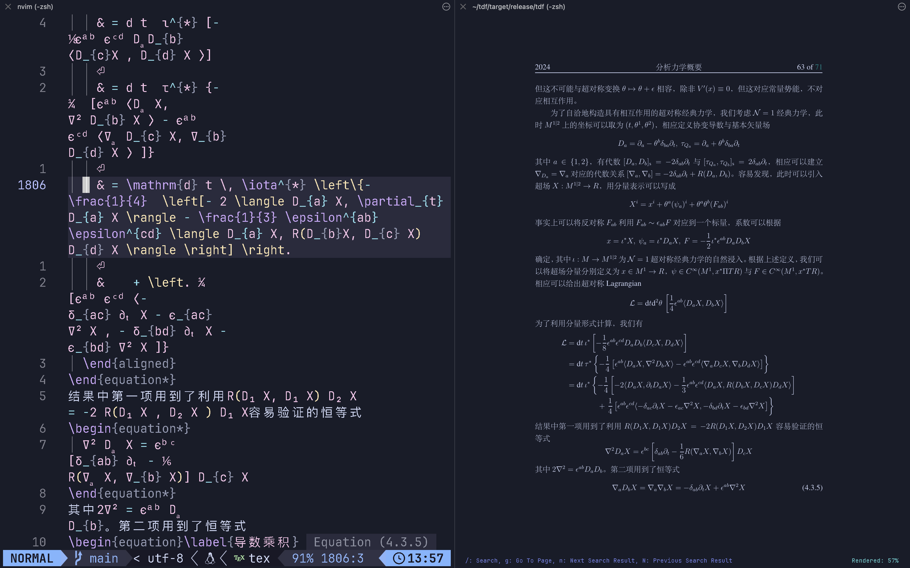

# 我的 neovim 配置 (基于 MacOS 和 iTerm2)



这是本人自用的 Neovim 配置，fork 自小马的 Neovim [配置](https://github.com/YinFengQi/nvim-config-based-on-lazyvim)。因为不满于 Neovim 原生的中文输入支持 (需要频繁切换输入法，且例如 `jj` `jk` 等的字母快捷键不能在中文输入法被激活时使用)，进行了基于 [rime](https://github.com/rime) 的中文输入法集成，实现了中文数学笔记的无输入法切换输入，目前中文输入经短期测试可以流畅使用，已被用于课堂笔记 (虽然现在很多都是用英文写的了) 、论文和实验报告 (这个必须得中文写) 的书写中。

*基本配置思路*：不出 BUG 就不动，出了 BUG 就修复，出了 BUG 修复不了就换插件 (这句话是 Copilot 写的)。*基本要求*：流畅书写第一位，能耗第二位，能不用 gui/gpu 加速就不用，尽可能保持终端的快速流畅低功耗 (这句话是我写的，目前在 M3 MacBook Pro 上可以使用约 15 小时，如果打开 gpu 加速大约可以用 6 小时)。

部分联动配置使用 apple script 实现，目前没有跨平台方案。Linux 下 inkscape 联动可以参考[castel 的绘图配置](https://github.com/gillescastel/inkscape-figures) 与 [castel 的图片管理配置](https://github.com/gillescastel/inkscape-shortcut-manager)。

## ✈️  Features

### 本配置关键：$\LaTeX$ 与中文输入法集成

* $\LaTeX$ 公式与 (一直在更新的) snippet 补全，实验报告数据处理的 python 计算快捷键集成;

* 基于 LSP [rime-ls](https://github.com/wlh320/rime-ls) 的中文输入法，自动匹配数学公式 (基于 [treesitter](https://github.com/nvim-treesitter/nvim-treesitter)) 转换为英文输入法，在英文输入环境中匹配数学公式并不切换输入法，实现中 - 英-$\LaTeX$ 的完全集成

* 集成 [copilotchat.nvim](https://github.com/CopilotC-Nvim/CopilotChat.nvim) 插件实现中文输入 (维护了一个 fork 以实现对其的兼容)

* 利用 [autoformat](https://github.com/huacnlee/autocorrect) 插件实现中文标点自动格式化 (对 latex 与 markdown 开启，在应用端修正了上游 formatter 的添加空行问题)，利用 [jieba](https://github.com/fxsjy/jieba) 实现中文分词;



* iTerm2 终端下的 pdf 终端预览，基于 [tdf](https://github.com/itsjunetime/tdf) 阅读器与 GPU 加速，允许利用快捷键 `<localleader>lf` 实现精确到*字符*的正向查找，利用快捷键 `<localleader>li` 输入页码实现精确到*页面*的反向查找，利用 AppleScript 与 synctex 实现 (现在精确到段落的反向查找由 [skim](https://skim-app.sourceforge.io/) 提供）;



* OS X 环境下的 [inkscape](https://inkscape.org/) 集成，实现 latex 文档编辑时的图片绘制快捷键调用，利用 AppleScript 实现。在存在 ipad 分屏的时候优先跳转到 ipad 分屏的 inkscape 窗口进行手绘，在不存在 ipad 分屏的时候跳转到 macos 的 inkscape 窗口进行绘图，利用 [SizeUp](https://www.irradiatedsoftware.com/sizeup/) 的 AppleScript 接口实现窗口管理;

* 为了集成上述七扭八歪配置做出了一系列反人类举动，通过配置加载序列目前启动速度稳定在 35ms 左右;

~~你说得对，但是 neovim 是一款开源 (迫真) 的开放世界 (迫真) 游戏，在这里你将扮演 root，导引 lua 之力，与一系列 readme 一行，没有 doc 的插件斗智斗勇，并在*解决插件冲突*的过程中逐渐发掘 **VScode** 的真相~~

### UI 美化

* [snacks](https://github.com/folke/snacks.nvim) Dashboard 的 logo 是我和女朋友的互称，即猫猫狗狗。目前选自 [ASCII 狗狗图](https://www.asciiart.eu/animals/dogs) 与 [ASCII](https://www.asciiart.eu/animals/cats)，以后想要转换成自己画的图;

* 因为过往老 MacBook Pro 的黑暗三小时 VSCode 续航支持，我对 **续航** 具有较高的要求。鉴于整体需要使用 GPU 加速，不可避免会压缩 M3 MacBook Pro 的续航时间，因此我配置了一个电池电量监控，用 `pmset` 读取电池电量与剩余时间体现在 Dashboard 与 [lualine](https://github.com/nvim-lualine/lualine.nvim) 中，当我使用 kitty 终端时续航可以达到 12 小时以上，比较令人满意;

* 取消了占地方还不实用的 [bufferline](https://github.com/akinsho/bufferline.nvim)  插件 (这个插件事实上不符合我对 Neovim **全键盘控制哲学**的认识，因为它在 ui 层面诱导了鼠标的操作，并且确实很占空间)，集成 [harpoon](https://github.com/ThePrimeagen/harpoon/tree/harpoon2) 与 bufferline 的功能，配合 [telescope](https://github.com/nvim-telescope/telescope.nvim) 的 buffer 搜索快捷键 `<leader>,`等实现 buffer 管理。

## 🤔 TODO

* fork 并为本配置改写 [tdf](https://github.com/itsjunetime/tdf) , 实现鼠标点击的 pdf 位置读取，并使用 synctex 实现精确到*段落*的反向搜索 (本任务为长线作战，并不期待短期内实现，因为学习 rust 本身足够困难，作为物理系学生并没有多少时间)。因此一个替代方案是提交 issue，但我并不确定是否会因此在主分支上得到解决方案;

* 自行维护 [copilotchat.nvim](https://github.com/CopilotC-Nvim/CopilotChat.nvim) 的 fork 以实现高版本对 nvim-cmp 的兼容 ✅;

* 优化 rime-ls 的加载行为，不在开机时触发，而是在特定文件类型中触发 (说真的，我目前还不会) ✅ (部分，暂时不再尝试更进一步操作，因为这会拖慢 tex 文件的加载速度);

* 优化 snack 中 dashboard 的 logo 变成自己画的图;

* 更换所有配置文件至 LazyVim API，精简后续配置，增加运行速度，为日后迁移到 LazyVim v13.+做准备;

* 更换所有配置至组合 kitty+macOS，实现更快更省电的性能展现 (iTerm2 有时候会卡，并且在打开 GPU 加速的时候会导致电池电量下降速度加快) (目前已经可以实现基本使用，除了 pdf 预览);

* 优化 telescope 的使用，增加词频搜索等功能; 

* 增加 boostrapping 脚本，实现自动利用 Homebrew 安装依赖。

## 🤝 Thanks to

* [YinFengQi](https://github.com/YinFengQi) 我使用 Neovim 的动机来源于他的酷炫操作😲;

* [Kaiser-Yang](https://github.com/Kaiser-Yang) ，参考了 ta 的 rime_ls 配置;

* [Fireond](https://github.com/Fireond) ，参考了 ta 的 luasnip 配置;

* [castel](https://github.com/gillescastel) ，参考了他的 inkscape 配置，让我首次意识到原来 inkscape 可以这么用🤯。

## 📦 Requirements and Usage

* 安装：直接 clone 到 `~/.config/nvim` 即可，换言之，运行
```shell
git clone https://github.com/pxwg/MACOS_nvim_config.git ~/.config/nvim
```
打开 neovim 即可自动安装插件，需要进行版本管理的插件已经在 lazylock 中锁定，避免冲突;

* MacOS & iTerm2 (目前没有跨平台方案) 😢 ，正在迁移到 kitty;

* neovim v0.9.5+，LazyVim v13.0- (目前没有改变所有 api 以适应 Breaking Update 的癖好，虽然期中考试考完了但也没有这么多时间，因此 LazyVim 被锁定在 v12.44.1, LazyVim 不需要下载，因为本配置文件会自行 boostrap 它);

* 可以使用 brew 安装的 hub, tdf, inkscape, skim, SizeUp, rimels, autocorrect。其余 neovim 插件可以在配置中自行安装;

* 利用类似 `install_name_tool -add_rpath /usr/local/lib /Users/pxwg-dogggie/Desktop/rime-ls-0.4.0/target/release/rime_ls` 的方式让 rime_ls 找到其依赖库。

